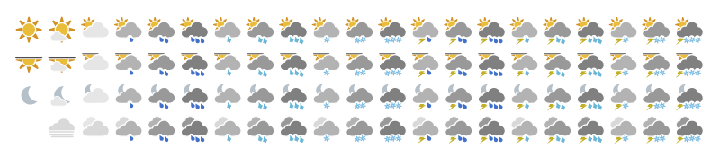

**[PREVIEW](http://yr.github.io/yr-weather-symbols/)**



Weather symbols for the next version of yr.no

## Download

Static versions of the symbols are available in both [png](https://github.com/YR/yr-weather-symbols/raw/master/dist/png.zip) and [svg](https://github.com/YR/yr-weather-symbols/raw/master/dist/svg.zip) formats. File names coincide with the ids used by the met.no/yr.no api.

## Usage

Dynamic versions of the symbols are also available. Drawing the symbols on the client saves in bandwidth and reduces the total number of browser requests, as well as opening up the possiblilty for animation and other effects. This also makes it possible to automatically choose the best format for the platform (svg > canvas > img) when rendering:

```html
<section>
  <div class="symbol" data-id="01d"></div>
  <div class="symbol" data-id="03d"></div>
  <div class="symbol" data-id="05n"></div>
  <div class="symbol" data-id="20d"></div>
</section>
```

```javascript
var weatherSymbol = require('./weatherSymbol');

document.querySelectorAll('.symbol')
  .forEach(function (symbol) {
    var options = {
      id: symbol.getAttribute('data-id'),
    };

    weatherSymbol(symbol, options);
  });
```